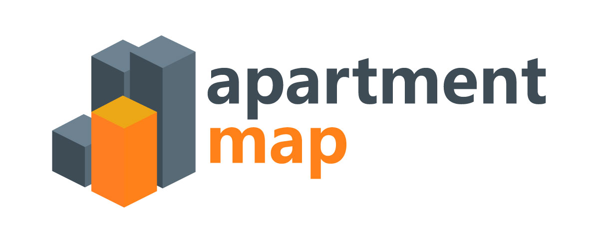

<p align="center">
 A Next TypeScript web application, SSR ready powered by Vercel and Supabase.
</p>

<br/>

<p align="center">
  <a href="#features"><strong>Features</strong></a> ·
  <a href="#local-development"><strong>Local Development</strong></a> ·
  <a href="#documentation"><strong>Documentation</strong></a> ·
</p>
<br/>

## Features

- ⚡️ Next.js 14 (App Router)
- 💚 Supabase
- ⚛️ React 18
- ⛑ TypeScript
- Zone MUI UI Kit + Material UI v5
- 100% React Hooks
- ESLint & Prettier
- React Hook Form with Validation + Yup
- Animated Framer Motion
- Image Lazy loading
- Fully responsive, and works across all modern/supported browsers & devices

## Development

### New Device Setup

When you first clone this repo on a **new** machine, ensure you have the following installed:

- [Node.js v18+](https://nodejs.org/en/download/).
  - Modern versions of Node ship with `yarn` corepack. It is recommended to use `yarn` as the package manager for this project (locally).
  - Inside this repo, it is recommended to use `yarn` commands instead of `npm` or `pnpm`, but this is optional, any should work, just be consistent with the package manager you choose.
- [Docker](https://www.docker.com) - Install Docker on your computer, on a Windows use Docker Desktop, [See Docs](https://www.docker.com/products/docker-desktop)
  - This is required to run Supabase locally for local development.
- [Vercel CLI](https://vercel.com/docs/cli) - Install the Vercel CLI globally via `npm`: [Vercel CLI Docs](https://vercel.com/docs/getting-started-with-vercel) and login to your Vercel account.
  - For example `npm i -g vercel`
- [Supabase CLI](https://supabase.com/docs/guides/cli/getting-started?queryGroups=platform&platform=windows) - Install the Supabase CLI globally, [See Docs](https://supabase.com/docs/guides/cli/getting-started?queryGroups=platform&platform=windows)
  - Follow the instructions to install the Supabase CLI, and login to your Supabase account.
  - When you get to running `supabase init`, you can skip this step, as the project is already initialized for this repo.
  - See the steps below for local development setup.

### Local Development

1. Run your local Supabase instance via Docker:

- Run `supabase start -x vector` to start the Supabase server locally (WITHOUT the vector container).
- You will be able to access a local Supabase instance at `localhost:54323`
- To find your local API keys and variables, run `supabase status`. You will use these in your local environment variable file.

2. You'll first need a Supabase project which can be made [via the Supabase dashboard](https://database.new)

3. Rename `.env.local.example` to `.env.local` and update the following:

   ```
   NEXT_PUBLIC_SUPABASE_URL=[INSERT SUPABASE PROJECT URL]
   NEXT_PUBLIC_SUPABASE_ANON_KEY=[INSERT SUPABASE PROJECT API ANON KEY]
   ```

   Both `NEXT_PUBLIC_SUPABASE_URL` and `NEXT_PUBLIC_SUPABASE_ANON_KEY` can be found in [your Supabase project's API settings](https://app.supabase.com/project/_/settings/api)

4. You can now run the Next.js local development server:

   ```bash
   pnpm run dev
   ```

   The starter kit should now be running on [localhost:3000](http://localhost:3000/).

> Check out [the docs for Local Development](https://supabase.com/docs/guides/getting-started/local-development) to also run Supabase locally.

# Documentation

### Requirements

- Node.js >= 18.17.0
